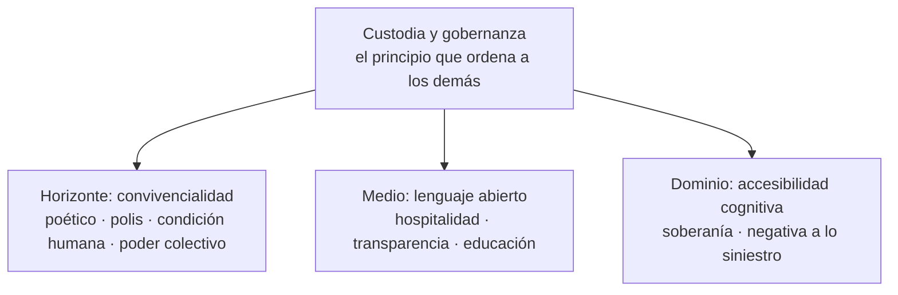

# Manifiesto de MediaFranca

Propuesta de versión mejorada del [Manifiesto para el Diseño de Interacción en un Tiempo que se Despliega](https://herbertspencer.net/2025/manifiesto) (2025), alineada con la misión de MediaFranca: **custodiar y gobernar los bienes públicos digitales**. Recoge y afina los principios del manifiesto original —también publicado en [github.com/mediafranca/manifesto](https://github.com/mediafranca/manifesto)— y añade la dimensión que es propia de MediaFranca: la custodia como acto de gobierno.[^origen]

Este documento es una propuesta abierta a revisión. No describe lo que MediaFranca ya hace, sino los compromisos que asumirá y bajo los cuales pedirá que se la juzgue. Está escrito, deliberadamente, en tiempo futuro.

## Preámbulo

El Diseño configura cómo nos relacionamos entre nosotros y con el mundo a través de la tecnología. Cada artefacto, interfaz y sistema define qué se vuelve accesible, qué se comparte y qué se excluye. La tecnología no es neutral: asume el rostro de quien la concibe, la financia, la regula y la utiliza.[^dignidad]

Vivimos un momento en que la inteligencia artificial concentra un poder técnico sin precedentes, mientras la pregunta por la dignidad de la persona sigue casi ausente del debate público. MediaFranca existirá para poner esa pregunta en el centro y para sostener, en común, las herramientas que nos permiten comunicarnos y participar del mundo. Estos principios orientan esa custodia.

## El Diseño es poético

El Diseño es inteligencia transformada en imaginación. Como navegantes que se hicieron cartógrafos, quienes diseñan crean mapas para lo cotidiano y dan forma a lo improbable. Su poesía consiste en reunir lo disperso, otorgar sentido y volver visible lo que aún no tiene forma. MediaFranca custodiará herramientas que abran ese espacio, no que lo clausuren.

## El Diseño pertenece a la polis

El Diseño existe entre las personas, como el lenguaje, y responde ante el colectivo. Su medida es relacional: exige una práctica situada, atenta a qué funciona, dónde y con quién, y capaz de hablar los lenguajes de lugares, tradiciones y comunidades. Pertenecer a la polis significa tratar la tecnología como medio cívico: claro, mantenible por la comunidad, culturalmente resonante, adaptable y transformable.

## El Diseño celebra la condición humana

El Diseño afirma que vivir trasciende lo meramente funcional. Cuando sostiene la dignidad, abre espacios para la convivencia, la expresión cultural y la renovación cotidiana, y florece en la pluralidad. Honra los valores humanos no como ideales abstractos sino como experiencias vividas: frágiles, diversas, siempre en devenir. Ninguna herramienta bajo custodia reducirá a la persona a función, dato o rendimiento.

## El Diseño fortalece el poder colectivo

El Diseño estructura relaciones, y esas relaciones nunca son neutrales: pueden empoderar o disminuir. Una herramienta bien diseñada permanece viva en su comunidad —adaptable, reparable, aprendible y abierta— y amplifica la capacidad colectiva sin anular la agencia individual. MediaFranca preferirá siempre las herramientas que reconocen a las personas como participantes que actúan, adaptan y co-crean, no como usuarios pasivos.

## El Diseño revela belleza a través de la hospitalidad

El Diseño muestra su mayor belleza cuando acoge. La hospitalidad implica apertura, claridad, legibilidad y transparencia; la accesibilidad es la hospitalidad del Diseño y su punto de partida, no su frontera. Todo artefacto tiene un revés —costuras, lógica y estructuras ocultas—: mostrarlo vuelve legible el proceso e invita a la apropiación, la reparación y la creación.

## El Diseño también puede ser siniestro

El Diseño posee poder, aunque quienes diseñan a menudo carezcan de él. Ese poder ha producido patrones oscuros: tácticas deliberadas que manipulan, coaccionan y socavan el consentimiento. La negativa será el primer instrumento de agencia: MediaFranca rehusará la manipulación y exigirá claridad, consentimiento genuino, reversibilidad y argumentación documentada en todo lo que custodie.

## El Diseño siembra soberanía tecnológica

La soberanía tecnológica es la capacidad de las comunidades para mantener el control sobre las tecnologías que habitan. No es aislamiento, sino resistencia a los sistemas cerrados y a las cadenas de suministro opacas. MediaFranca sostendrá tecnologías que las comunidades puedan apropiarse, modificar y redefinir culturalmente: código abierto y autoalojable, con datos que pertenecen a quienes los generan. El Diseño se vuelve así cultivo, no imposición.

## El Diseño revela sistemas con transparencia

Todo proyecto oculta y muestra a la vez. La transparencia consiste en mostrar ambos lados: qué se construye, cómo funciona y qué impacto tiene. El código abierto es su expresión tangible; cuando la fuente, la documentación y los flujos de trabajo son públicos, se crean las condiciones para la supervisión y la réplica comunitaria. MediaFranca no custodiará nada que no pueda inspeccionarse.

## El Diseño educa y se educa a sí mismo

Cada decisión de Diseño enseña, explícita o implícitamente, cómo convivir con otros y con lo técnico. El Diseño también se educa: aprende de sus caminos, se ensancha con la crítica y se renueva en interacción con quienes lo habitan. MediaFranca tratará lo aprendido en los procesos de codiseño como patrimonio común, que circulará libremente bajo licencias abiertas.

## El Diseño se custodia y se gobierna

Este es el principio propio de MediaFranca, y el que ordena a los demás. Un bien común digital no se sostiene solo: sin gobernanza, tiende a la captura privada, al abandono o a la dependencia. Custodiar no será archivar. Significará financiar y mantener el desarrollo, vigilar los estándares, proteger los comunes de la apropiación y garantizar que el conocimiento circule.

Quién gobierna el Diseño importa tanto como el Diseño mismo. Por eso MediaFranca definirá, de cara al público y con criterios auditables, qué merece cuidarse como bien público digital y bajo qué reglas.[^dpg] La custodia será activa, o no será.

## Corolario

El Diseño debe ir más allá de producir lo posible y comprometerse con deliberar lo deseable. Todo Diseño participa en la configuración de un mundo compartido. Diseñar es, en última instancia, asumir la responsabilidad por el futuro de la convivencia humana; custodiar es asegurar que esa responsabilidad no quede en manos de nadie que no rinda cuentas ante la comunidad.

## Notas

[^origen]: Manifiesto original: *Manifiesto para el Diseño de Interacción en un Tiempo que se Despliega* (2025), publicado en español en [herbertspencer.net/2025/manifiesto](https://herbertspencer.net/2025/manifiesto) y en [github.com/mediafranca/manifesto](https://github.com/mediafranca/manifesto). Esta versión conserva sus nueve principios, afina su lenguaje y añade un décimo —la custodia y la gobernanza— que expresa la contribución específica de MediaFranca.

[^dignidad]: Esta preocupación resuena con la encíclica [*Magnifica Humanitas*](https://www.vatican.va/content/leo-xiv/es/encyclicals/documents/20260515-magnifica-humanitas.html) de León XIV (2026), sobre la custodia de la persona en tiempos de inteligencia artificial. MediaFranca no es una iniciativa confesional; recoge esa advertencia como parte de una conversación pública más amplia sobre la técnica a escala humana.

[^dpg]: El criterio de custodia se alineará con el [DPG Standard](https://github.com/DPGAlliance/dpg-standard) y sus nueve indicadores: licencias abiertas, propiedad clara, independencia de plataforma, documentación, extracción de datos, privacidad, estándares, mejores prácticas y no hacer daño.
