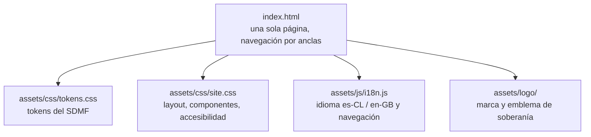

# MediaFranca

Sitio público de [mediafranca.net](https://mediafranca.net/).

MediaFranca es una iniciativa que busca socios fundadores para constituir, a futuro, una corporación de derecho privado sin fines de lucro en Valparaíso, Chile. Custodiará tecnologías convivenciales para la comunicación humana: software, estándares, esquemas y contenidos de lenguaje abierto.[^1]

El puño alzado expresa su postura de soberanía tecnológica: las herramientas
deben amplificar la agencia de las personas y permanecer bajo el gobierno de las
comunidades que las habitan. El activo vive en `assets/logo/raised-fist.svg` y
se acredita en el propio sitio.

El sitio está escrito deliberadamente en tiempo futuro: describe lo que MediaFranca será, no lo que ya es. Sirve para explicar la filosofía del proyecto a amigos, colaboradores y potenciales socios.

## Filosofía técnica del sitio

El sitio encarna los mismos principios que enuncia. Por eso es lo más simple y auditable posible: HTML, CSS y JavaScript estáticos, sin framework, sin build y sin trackers. La constelación de proyectos es SVG y HTML legible, no una visualización generada por una librería. La única dependencia de ejecución externa es IBM Plex Mono, servida por Google Fonts mientras no se aloje localmente.[^2]



## Estructura del repositorio

```
mediafranca.github.io/
├── index.html              Página única, bilingüe, con las secciones del sitio
├── assets/
│   ├── css/
│   │   ├── tokens.css      Tokens del Sistema de Diseño MediaFranca
│   │   └── site.css        Estilos de layout, componentes y accesibilidad
│   ├── js/
│   │   └── i18n.js         Conmutación de idioma y navegación por anclas
│   └── logo/
│       ├── mf.svg          Marca de MediaFranca
│       └── raised-fist.svg Emblema de soberanía tecnológica
├── CNAME                   Dominio para GitHub Pages (mediafranca.net)
├── .nojekyll               Desactiva el procesado Jekyll en GitHub Pages
├── robots.txt
├── sitemap.xml
├── LICENSE                 Dual: MIT (código) y CC BY 4.0 (contenido)
└── README.md               Este archivo
```

## Multilenguaje

El sitio es bilingüe español de Chile (es-CL) e inglés británico (en-GB). El contenido traducible vive como pares de `<span data-lang="es|en">` dentro del HTML, de modo que el texto es auditable en el propio fuente.

El comportamiento es progresivo: sin JavaScript, el HTML muestra el español por defecto. Con JavaScript, `assets/js/i18n.js` detecta el idioma del navegador (cualquier variante de inglés abre el sitio en inglés), permite conmutar con los botones ES/EN, recuerda la elección en `localStorage` y actualiza el atributo `lang` de `<html>` para lectores de pantalla.

## Lenguaje de diseño

El Sistema de Diseño MediaFranca (SDMF) usa una página de papel cálido, tinta oscura, un único acento ámbar e IBM Plex Mono. Los tokens separan color, tipografía, ritmo, espaciado y movimiento de los componentes que los consumen. El sitio tiene deliberadamente un solo tema claro.

## Accesibilidad

Objetivo WCAG 2.1 AA: enlace de salto al contenido, foco visible, navegación operable por teclado, contraste suficiente, imágenes y controles rotulados y respeto a `prefers-reduced-motion`.

## Edición local

No requiere instalación. Basta un servidor estático:

```bash
cd ~/Sites/mediafranca.github.io
python3 -m http.server 8000
```

Abrir `http://localhost:8000`. También puede abrirse `index.html` directamente en el navegador; las fuentes se cargan por CDN.

### Acceso desde otros dispositivos con Tailscale

Para probar el sitio desde otro equipo de la misma *tailnet* (por ejemplo, un
teléfono), instalar [Tailscale](https://tailscale.com/download), iniciar sesión y
mantener el servidor local anterior en ejecución. En otra terminal:

```bash
tailscale serve --bg 8000
tailscale serve status
```

`tailscale serve status` muestra la URL HTTPS privada. Solo los dispositivos
autorizados en la misma *tailnet* pueden abrirla. Al terminar:

```bash
tailscale serve reset
```

### Vista previa pública temporal con Cloudflare Tunnel

Para compartir una revisión sin publicar en GitHub Pages, instalar
[`cloudflared`](https://developers.cloudflare.com/cloudflare-one/connections/connect-networks/downloads/)
y, con el servidor local ejecutándose en el puerto 8000, abrir un túnel rápido:

```bash
cloudflared tunnel --url http://localhost:8000
```

El comando entrega una URL temporal `https://….trycloudflare.com`; debe mantenerse
en ejecución mientras se usa y se cierra con `Ctrl+C`. Es una dirección pública:
no debe usarse para contenido privado ni como despliegue permanente. Para una
URL estable y controles de acceso corresponde configurar un túnel administrado
en Cloudflare Zero Trust.

## Despliegue en GitHub Pages

1. Empujar la rama `main` de `mediafranca/mediafranca.github.io`.
2. En `Settings > Pages`: Source = `Deploy from a branch`, Branch = `main`, Folder = `/ (root)`.
3. En `Custom domain` ingresar `mediafranca.net`. GitHub leerá el archivo `CNAME` y emitirá el certificado HTTPS.
4. Activar `Enforce HTTPS`.

El DNS de `mediafranca.net` ya apunta a GitHub Pages desde Namecheap (cuatro registros `A` al apex).

## Licencia

Contenido bajo [CC BY 4.0](https://creativecommons.org/licenses/by/4.0/); código bajo [MIT](https://opensource.org/license/mit). Ver [LICENSE](LICENSE).

## Notas

[^1]: La visión y misión canónicas viven en el grafo Logseq privado del custodio (`MediaFranca - Visión y Misión`). Este repositorio contiene solo el sitio público; los documentos de gobernanza (estatutos, plan operativo, modelo de fiscal host) no se versionan aquí.

[^2]: El sitio de referencia previo usaba p5.js desde un CDN para la constelación. Esta versión conserva el grafo como SVG y HTML estáticos. Queda pendiente autoalojar IBM Plex Mono para eliminar también la dependencia de Google Fonts.
